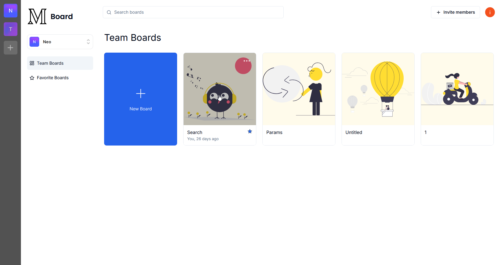

<div align="center">
  <br />
    <a href="https://miron-seven.vercel.app" target="_blank">
      
    </a>
  <br />
  <div>
    
    
    
    
    
    
  </div>
  <h3 align="center">Miron: The Collaborative Whiteboard</h3>

   <div align="center">
     A powerful, real-time collaborative whiteboard application built with cutting-edge web technologies.
    </div>
</div>

## 🍁 Overview

An online whiteboard for teams/organizations allowing for realtime collaboration with many features, user authentication and a nice UI. It serves as a clone of **Miro** with a very small subset of features of Miro. The project is from [**Code with Antoino**](https://codewithantonio.com/) with few extra features.
<br />

### 💻 Technolgoies

[](https://react.dev/ "React JS") [](https://nextjs.org/ "Next JS") [](https://www.typescriptlang.org/ "Typescript") [](https://tailwindcss.com/ "Tailwind CSS") [](https://vercel.app/ "Vercel")

- **Language**: Typescript
- **Frontend**: [Next.js 14](https://nextjs.org/) and UI Components via [`shadcn/ui`](https://ui.shadcn.com/)
- **Backend + Primary Database**: [Convex](https://www.convex.dev/)
- **Realtime + Secondary Database**: [Liveblocks](https://liveblocks.io/)
- **Authentication**: [Clerk](https://convex.com/)

## 📃 Table of Contents

- [🍁 Overview](#-overview)
  - [💻 Technolgoies](#-technolgoies)
- [📃 Table of Contents](#-table-of-contents)
- [🚀 Features](#-features)
- [🤝 Usage](#-usage)
- [⚙️ Setup](#️-setup)
- [📱 Screenshots](#-screenshots)
- [📄 Additional Notes](#-additional-notes)

## 🚀 Features

- **🌍 Realtime Collaboration**: Multiple users can interact with and on the board simultaneously.
- **🔒 Authentication**: Secure Authentication using Clerk for Google and Github
- **🎨 Intuitive UI**: Minimal clean UI, Loading indicators, toasts, tooltips and more
- **🏢 Organization Support**: Switch between organizations/teams and create favorite boards within each
- **🖌️ Versatile Canvas**: Options to add shapes, text, notes and draw freely with many tools. Also a **laser** tool 
- **✏️ Drawing Tools**: Select any layer and change it's color to any color, duplicate it, move to front or back or delete it. Ability to select multiple layers
- **⌨️ Keyboard Shortcuts**: Use the whiteboard with accessible keyboard shortcuts 
- **📷 Export as PNG**: Export your board as a PNG!

## 🤝 Usage

1. Go visit the site and you'll be prompted to sign in
2. Once signed in join an existing organization or make your own (Total limit is 50 so it's possible you won't be able to)
3. After you're in an organization go to an existing board or make a new one (Limit of 5 per organization)
4. You can now freely draw!

## ⚙️ Setup

- Follow these steps first
```shell
git clone https://github.com/Eshan05/Miron
cd Miron
pnpm i
```
- Now to setup up your `.env.local`:
  1. First look at `.env.sample`, these are all variables you need
  2. For convex visit their site and sign in/up, then make a new project and from there you can get two keys
  3. For clerk do the same as above, but also the following: 
     1. **Enable organizations**
     2. Add *JWT Template* named `convex`
     3. Have something like the following [image](https://i.ibb.co/XSNkkbj/335855090-1536a650-4898-46e0-8e7c-3c2dc229688a.png)
     4. Add issuer into `auth.config.js` inside `/convex`
     5. Prepare convex functions via `pnpx convex dev`
  4. For liveblocks also do the same and get two keys
  5. You should be all set, have two terminals: One `pnpm run dev` and one `pnpx convex dev`

## 📱 Screenshots




<!--  -->

## 📄 Additional Notes

- See LICENSE (GPLv3)
- Feel free to raise issues if you notice anything wrong
